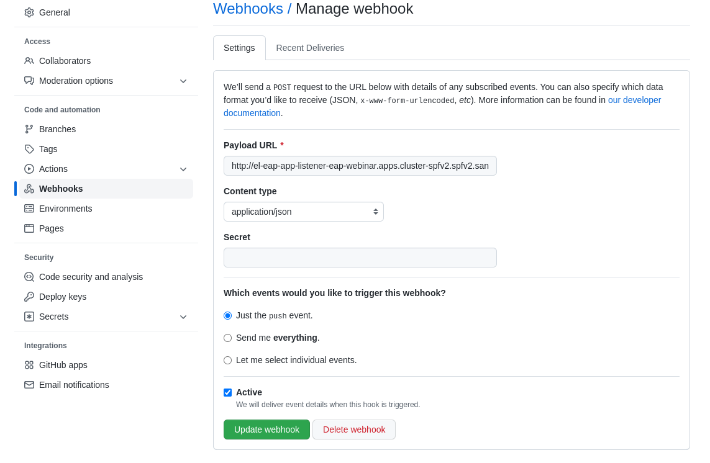

# Deploy EAP app to OpenShift with external db (MySQL)

This repository contains the deployment for the EAP application deployed to OpenShift with external database (MySQL).

The EAP application code is maintained in https://github.com/deewhyweb/eap-quickstarts.git in the kitchensink folder.

The OpenShift objects in this repository will create two build configs and image streams.

1. Build the artifact image
2. Build the EAP application image

The first step is to build the artifact image, this is where the maven build of the EAP application is performed.

The second step is to build the EAP application image, this is where the EAP runtime image is created including the artifcact built in the previous step.
## pre-requisites

* OpenShift cluster 
* Openshift command line tool installed and logged into cluster.

## Steps to deploy EAP app to OpenShift

Create the OpenShift project

`oc new-project eap-webinar`

Deploy mysql

`oc new-app  -e MYSQL_DATABASE=eap -e MYSQL_PASSWORD=demo -e MYSQL_USER=eap mysql-persistent `


Install the helm cli following these instructions https://helm.sh/docs/intro/install/


Install the helm chart

`helm install eap74 -f install-helm.yml http://github.com/openshift-helm-charts/charts/releases/download/redhat-eap74-1.1.0/redhat-eap74-1.1.0.tgz`


Wait for the two builds to complete, eap_app_build_artifacts and eap_app.  This will take a few minutes.

Create the config map with mysql environment variables;

`oc apply -f eap-cm.yml`

Deploy the JBoss EAP operator

`oc apply -f eap-operator.yml`

Deploy the instance of the eap application using the operator

`oc apply -f eap-deploy.yml`

Navigate to the route to test out the application.


## To use pipelines

The following steps will deploy a tekton pipeline to take over the maven test and package tasks.

Install the OpenShift Pipelines operator

`oc apply -f pipelines-operator.yml`

Deploy maven, git-clone, and openshift-client tekton modules

`oc apply -f https://raw.githubusercontent.com/tektoncd/catalog/main/task/maven/0.2/maven.yaml`

`oc apply -f https://raw.githubusercontent.com/tektoncd/catalog/main/task/git-clone/0.8/git-clone.yaml`

`oc apply -f https://raw.githubusercontent.com/tektoncd/catalog/main/task/openshift-client/0.2/openshift-client.yaml`

Create the pipeline

`oc apply -f pipeline.yml`

Create a pipeline run

`oc create -f pipelineRun.yml`

The pipeline should run and deploy the application using the operator

## Triggering the pipeline

Create the trigger

`oc apply -f trigger.yml`

Create the trigger binding

`oc apply -f triggerBinding.yml`

Create the trigger template

`oc apply -f triggerTemplate.yml`

Create the event listener

`oc apply -f eventListener.yml`

Expose the event listener route

`oc expose svc el-eap-app-listener`

Test the event listener route

`export eventhost=$(oc get route el-eap-app-listener -o custom-columns=host:spec.host --no-headers)`

```
curl -X POST \
  http://$eventhost \
  -H 'Content-Type: application/json' \
  -d '{ "commit_sha": "22ac84e04fd2bd9dce8529c9109d5bfd61678b29",  "repository": {"url": "https://github.com/deewhyweb/eap-quickstarts.git", "name": "eap-migration"}}'
```

## Triggering the pipeline from Github

You will need to fork the eap-quickstarts repo to your own github account.  Once you have done this, goto the setting tab of your repo and click on webhooks, fill out the form as shown:



Push updated code to the repo, the pipeline should start, taking the git url etc. from the webhook call.

